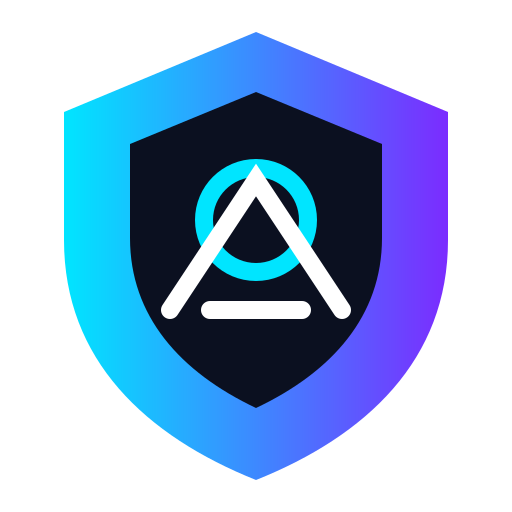

<div align="center">



# 🛡️ AEGIS AI

### Local-First Cybersecurity Intelligence Assistant

**A private AI security companion running on your machine.**

[](LICENSE)
[]()
[]()
[]()

</div>

---

## ⚡ What is AEGIS?

AEGIS is an open-source local AI assistant designed for cybersecurity professionals, researchers and learners.

It combines:

- 🧠 Local language models
- 🔐 Security knowledge bases
- 📊 Intelligent analysis
- 🖥️ Desktop and CLI interfaces
- 🧩 Plugin-based architecture

**Your data stays on your machine.**

---

## 🎯 Mission

Create the ultimate privacy-first AI companion for defensive cybersecurity work.

AEGIS does not replace security professionals — it amplifies them.

---

# ✨ Features

| Module | Status |
|---|---|
| Local AI Runtime | 🚧 Building |
| CLI Assistant | 🚧 Building |
| Desktop Application | 📅 Planned |
| Security Log Analysis | 📅 Planned |
| Code Security Review | 📅 Planned |
| Knowledge Base | 📅 Planned |
| Plugin System | 📅 Planned |
| MITRE ATT&CK Integration | 📅 Planned |

---

# 🏗️ Architecture

```text
                 AEGIS AI
                    |
        ┌───────────┴───────────┐
        |                       |
   AI Core Engine          User Interface
        |                       |
 ┌──────┼──────┐          ┌─────┴─────┐
 |      |      |          |           |
Memory Agents Tools      CLI       Desktop

        |

 Security Intelligence Layer
```

---

# 🚀 Roadmap

## v0.1.0 Foundation

- [x] Repository created
- [x] Documentation structure
- [x] Brand identity
- [ ] Local AI engine
- [ ] CLI prototype
- [ ] First security modules

## v0.5.0

- Plugin marketplace
- Knowledge graph
- Advanced reports
- Multi-model support

## v1.0.0

- Production desktop application
- Kali Linux integration
- Community ecosystem

---

# 🛠️ Development

```bash
git clone https://github.com/dyrnoi404/aegis-ai.git
cd aegis-ai
```

---

# 🔒 Philosophy

```
Privacy first.
Local first.
Open source forever.
```

---

# 🤝 Contributing

Contributions, ideas and security research are welcome.

See:

- CONTRIBUTING.md
- SECURITY.md

---

<div align="center">

Built with ❤️ for the cybersecurity open-source community.

</div>
