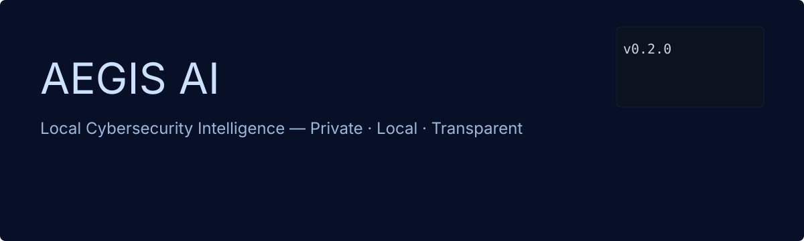

<!-- name: README.md -->

# AEGIS AI



Local Cybersecurity Intelligence Assistant

Private. Local. Transparent.

[](LICENSE) [](https://www.python.org/) [](docker-compose.yml) [](SECURITY.md)

Short description

AEGIS AI is a private, local-first cybersecurity intelligence workstation and assistant. It helps security professionals analyze logs, review code, create incident reports and run AI-powered local analysis without sending sensitive data to third-party services.

Why AEGIS?

- Runs locally — keep data private
- Modular — replace or extend components (AI engine, vector store, memory)
- Extensible — plugins, CLI, and future desktop app
- Designed for security professionals and integrations with Kali/Debian tooling

Features matrix

| Module | Status |
|---|---:|
| Local AI Engine | 🚧 In development |
| CLI Assistant | ✅ Minimal CLI |
| Desktop App | 🔜 Planned |
| Log Analysis | 🔜 Planned |
| Code Review | 🔜 Planned |
| Knowledge Base | 🔜 Planned |
| Plugin System | 🔜 Planned |


Quick demo (CLI)

Run the built-in CLI placeholder:

```bash
python -m cli.aegis
# or
./cli/aegis
```

Architecture

```mermaid
flowchart LR
  subgraph A[AEGIS AI]
    API[API Service (FastAPI)]
    AI[AI Engine (local model runtime)]
    DB[Postgres DB]
    VEC[Vector Store (Redis/Weaviate)]
    STORAGE[Storage / Filesystem]
  end

  API --> AI
  API --> DB
  API --> VEC
  AI --> VEC
  API --> STORAGE
```

Quickstart

Prerequisites: Docker & Docker Compose (recommended) or Python 3.11 (development)

1. Clone the repository
2. docker compose up --build

Development (virtualenv):

```bash
python -m venv .venv
source .venv/bin/activate
pip install -r requirements.txt
python -m cli.aegis
```

Project layout

- README.md — this file (English)
- README.ru.md — Russian translation
- i18n/ — localized docs (en/ru)
- backend/ — core Python packages and agents
- cli/ — command line entrypoints
- assets/ — logos, banner and previews
- docker-compose.yml — development stack (api, ai_engine, db, vector)
- .github/ — CI and templates

Contributing

Contributions are welcome. See GOVERNANCE.md and CONTRIBUTING.md (TODO) for more information. Please follow good security disclosure practices — use SECURITY.md for reporting.

License

AEGIS AI is released under the MIT License. See LICENSE.

---

If you prefer the Russian main README, see README.ru.md.
